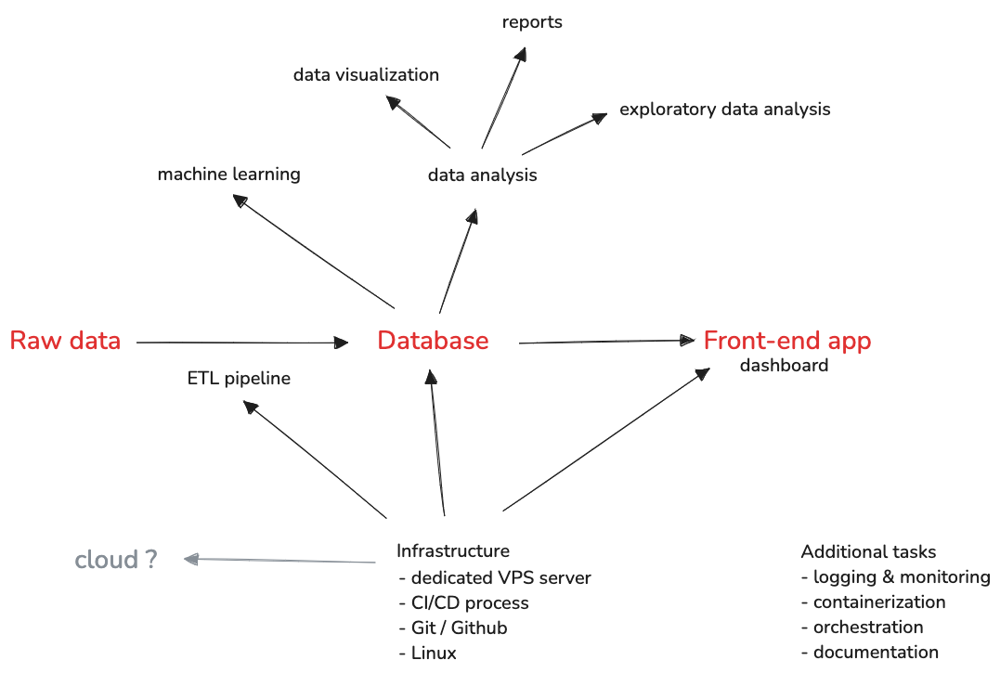

# 🚲 Wrocław Bike Stats — Data Engineering & Analytics Sandbox

**Wrocław Bike Stats** is an educational *sandbox* project designed for anyone interested in developing their skills in **data engineering**, **data analytics**, and **data science** — based on real, continuously updated data from the Wrocław city bike system.

The project is open and flexible — a great opportunity to learn, experiment, and build your portfolio, regardless of your experience level. Everyone is welcome to join and focus on specific areas of interest. You don’t have to cover everything at once.

## 💡 Main Goals of the Project

- Create an environment for learning how to work with real-world data
- Practice real data engineering and analytics tasks
- Gain experience in team collaboration (Git, PRs, communication)
- Co-design a data-driven analytics application based on live data

## 🗺 Project Roadmap

Below you’ll find a draft “roadmap” highlighting different areas the project covers. As you can see — there’s something interesting here for everyone, no matter your background or interests.

## 🧩 Example Tasks You Can Work On

- Writing SQL queries and analyzing data
- Designing and managing a database
- Creating reports and data visualizations
- Building a dashboard and designing web app features
- Designing and implementing ETL / data pipelines
- Developing machine learning models (e.g. predicting daily bike rentals)
- Practicing collaborative work using Git and GitHub

## 📊 Why Is This Project Interesting?

- We’re working with **real, current, and large-scale data** — over 3.5 million rides in the past two years
- A great way to gain hands-on experience without the pressure of commercial projects
- Ideal project to include in your portfolio
- If you're a data nerd — this is the right place for you

## 👥 Who Is This Project For?

Anyone — from beginners to experienced data enthusiasts. You can join at any time and work on whatever part of the project interests you most. It’s a typical open-source-style project.

## 📌 Want to Join?

Interested or have any questions? Feel free to reach out — I’ll be happy to tell you more.  
Contact: `wojtek.karcz@gmail.com`
